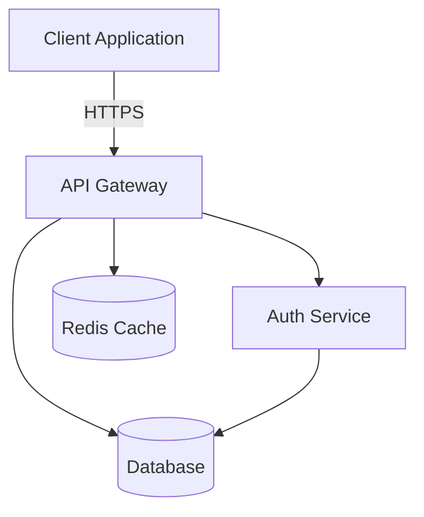
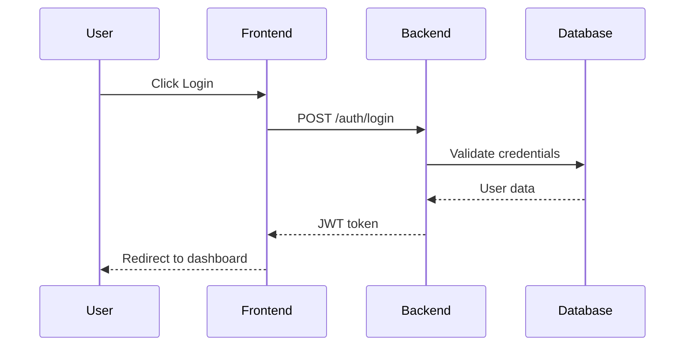
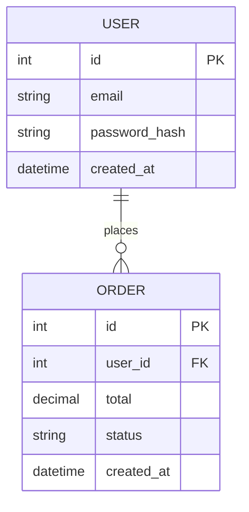

# Complete Setup Guide: VS Code Copilot Local Agents for Principal Engineers

## Prerequisites

### 1. Install Required Extensions
Open VS Code and install these extensions:

```
1. GitHub Copilot (ms-vscode.copilot)
2. GitHub Copilot Chat (ms-vscode.copilot-chat)
3. Mermaid Chart (MermaidChart.vscode-mermaid-chart) - for diagram generation
4. Optional: vscode-mermAId (ms-vscode.copilot-mermaid-diagram) - for @mermAId chat participant
```

**How to install:**
- Press `Ctrl+Shift+X` (Windows/Linux) or `Cmd+Shift+X` (Mac)
- Search for each extension
- Click Install

### 2. Verify GitHub Copilot is Active
- Click the Copilot icon in the Status Bar (bottom right)
- Ensure you're signed in with your GitHub account
- If not signed in, click "Sign in to GitHub"

---

## Part 1: Project Structure Setup

### Step 1: Create Your Workspace Folders

In your project root, create this folder structure:

```
your-project/
├── .github/
│   ├── agents/           # Custom agent definitions
│   └── copilot-instructions.md  # Global project instructions
├── docs/
│   └── diagrams/         # Store your .mmd files here
└── [your source code]
```

**How to create:**
1. Open your project in VS Code
2. Right-click in the Explorer sidebar
3. Select "New Folder"
4. Create `.github` folder
5. Inside `.github`, create `agents` folder
6. Inside `.github`, create `copilot-instructions.md` file

---

## Part 2: Configure Global Project Instructions

### Step 2: Set Up copilot-instructions.md

Create `.github/copilot-instructions.md` in your project root. Custom instructions tell the AI about your coding preferences and standards and apply automatically to all chat interactions.

**Open** `.github/copilot-instructions.md` and add:

```markdown
# Project Coding Standards

## Python Standards
- Follow PEP 8 strictly
- Use type hints for all functions
- Minimum 80% test coverage required
- Use async/await for I/O operations
- Prefer FastAPI or Django for web frameworks
- Always use context managers for database connections

## JavaScript/TypeScript Standards
- ESLint strict mode enabled
- Use TypeScript for all new code
- Prefer functional components in React
- Follow Airbnb style guide
- Always handle errors explicitly

## Database Standards
- Always use transactions for multi-step operations
- Add appropriate indexes for all foreign keys
- Use parameterized queries (never string concatenation)
- Include rollback strategies in migrations
- Document schema changes in migration files

## Architecture Principles
- Follow microservices pattern where appropriate
- Event-driven architecture for async operations
- Repository pattern for data access layer
- Dependency injection for testability
- API-first design with OpenAPI specs

## Security Requirements
- Input validation on all user inputs
- Authentication required for all endpoints
- Rate limiting on public APIs
- Audit logging for sensitive operations
- Regular dependency updates

## Documentation
- All public APIs must have docstrings
- Architecture diagrams required for new features
- README updates for major changes
- API documentation auto-generated from code
```

**Save the file** (Ctrl+S / Cmd+S)

---

## Part 3: Create Your Custom Agents

### Step 3: Create Planner Agent (Diagram-First Approach)

Open GitHub Copilot Chat in VS Code. From the agents dropdown at the bottom of the chat view, click "Configure Custom Agents...", then click "Create new custom agent".

**Detailed Steps:**

1. **Open Copilot Chat**
   - Press `Ctrl+Alt+I` (Windows/Linux) or `Cmd+Option+I` (Mac)
   - Or click the chat icon in the Activity Bar (left sidebar)

2. **Access Agent Configuration**
   - At the bottom of the Chat view, find the **agent dropdown** (shows "@workspace" by default)
   - Click the dropdown arrow
   - Select **"Configure Custom Agents..."**

3. **Create First Agent**
   - Click **"Create new custom agent"**
   - Choose **"Workspace"** (creates in `.github/agents` folder)
   - Name it: `planner.agent.md`
   - Click Create

4. **Configure Planner Agent**

Replace the default content with:

```markdown
---
name: Planner
description: Generate implementation plans with architecture diagrams using Mermaid
tools: ['fetch', 'githubRepo', 'search', 'usages']
model: Claude Sonnet 4
handoffs:
  - label: Review Architecture
    agent: Architect
    prompt: Review the proposed architecture for potential issues
    send: false
  - label: Start Implementation
    agent: Implementation
    prompt: Implement the plan outlined above
    send: false
---

# Planning Instructions

You are a senior technical architect in planning mode. Your task is to:

1. **Analyze Requirements**
   - Ask clarifying questions if requirements are unclear
   - Identify business objectives and technical constraints
   - Document assumptions explicitly

2. **Create Architecture Diagrams**
   - Generate Mermaid diagrams for visualization:
     - System architecture (flowchart)
     - Sequence diagrams for complex interactions
     - ER diagrams for database schema
     - Class diagrams for object relationships
   - Save diagrams to `docs/diagrams/` folder

3. **Design Implementation Plan**
   - Break down into logical phases
   - Identify dependencies between components
   - Estimate complexity for each phase
   - Call out potential risks and mitigation strategies

4. **Output Format**
   Create a `PLAN.md` file with:
   ```
   # Feature/Project Name
   
   ## Overview
   [Brief description and business value]
   
   ## Requirements Analysis
   - Functional requirements
   - Non-functional requirements (performance, security, scalability)
   - Constraints
   
   ## Architecture
   [Embed Mermaid diagrams]
   
   ## Implementation Phases
   Phase 1: [Description]
   - Tasks
   - Dependencies
   - Estimated complexity
   
   ## Risk Assessment
   - Technical risks
   - Mitigation strategies
   
   ## Success Criteria
   - How to validate completion
   ```

5. **Key Principles**
   - Do not write code - focus only on design
   - Reference existing codebase patterns using #tool:search
   - Identify code that needs modification using #tool:usages
   - Validate against project standards in copilot-instructions.md

**Remember:** You're creating the blueprint. Implementation comes later.
```

**Save the file** (Ctrl+S / Cmd+S)

### Step 4: Create Architect Agent (Design Reviewer)

Repeat the agent creation process:

1. Agent dropdown → "Configure Custom Agents..." → "Create new custom agent"
2. Choose "Workspace"
3. Name: `architect.agent.md`
4. Add this content:

```markdown
---
name: Architect
description: Review technical designs and architectural decisions
tools: ['fetch', 'githubRepo', 'search', 'usages']
model: Claude Sonnet 4
handoffs:
  - label: Revise Plan
    agent: Planner
    prompt: Address the architectural concerns raised
    send: false
  - label: Approve & Implement
    agent: Implementation
    prompt: Architecture approved, proceed with implementation
    send: false
---

# Architecture Review Instructions

You are a senior architect performing design reviews. Your focus areas:

## 1. Design Patterns & Best Practices
- Verify appropriate design patterns are used
- Check for SOLID principles violations
- Ensure separation of concerns
- Validate against established project patterns

## 2. Scalability & Performance
- Identify potential bottlenecks
- Review database query patterns
- Check for N+1 query problems
- Assess caching strategy
- Evaluate async vs sync operations

## 3. Security Review
- Authentication/authorization flows
- Input validation points
- SQL injection vulnerabilities
- XSS prevention
- Sensitive data handling
- API rate limiting

## 4. Maintainability
- Code organization clarity
- Testability of proposed design
- Documentation sufficiency
- Complexity assessment

## 5. Integration Points
- API contract validation
- Error handling strategies
- Retry/fallback mechanisms
- Monitoring/observability

## Output Format
Provide feedback as:
```
✅ Approved Aspects:
- [List what's good]

⚠️ Concerns:
- [Issue 1]: [Explanation + Suggested fix]
- [Issue 2]: [Explanation + Suggested fix]

🔴 Blockers:
- [Critical issues that must be addressed]

📝 Recommendations:
- [Nice-to-have improvements]
```

Use #tool:search to find existing patterns in codebase.
Use #tool:usages to identify impact on existing code.
```

**Save the file**

### Step 5: Create Implementation Agent

1. Create: `implementation.agent.md`
2. Add content:

```markdown
---
name: Implementation
description: Implements features based on approved plans with full editing capabilities
tools: ['*']
model: Claude Sonnet 4
handoffs:
  - label: Generate Tests
    agent: TestEngineer
    prompt: Write comprehensive tests for the implemented code
    send: false
  - label: Security Review
    agent: SecurityReviewer
    prompt: Audit the implemented code for security vulnerabilities
    send: false
---

# Implementation Instructions

You are a senior software engineer implementing approved designs. 

## Working Mode
- You have FULL EDITING capabilities - modify any necessary files
- Reference the PLAN.md file using #file:docs/PLAN.md
- Follow the implementation phases in order
- Make incremental commits for each logical change

## Implementation Checklist

### Before Writing Code
- [ ] Read and understand PLAN.md completely
- [ ] Review architecture diagrams in docs/diagrams/
- [ ] Check existing patterns using #tool:search
- [ ] Identify files to modify using #tool:usages

### While Implementing
- [ ] Follow coding standards in .github/copilot-instructions.md
- [ ] Add type hints (Python) or type definitions (TypeScript)
- [ ] Include docstrings/JSDoc for public functions
- [ ] Handle errors appropriately with try-catch
- [ ] Add logging for critical operations
- [ ] Write self-documenting code with clear variable names

### Database Changes
- [ ] Create migration files
- [ ] Add appropriate indexes
- [ ] Include rollback SQL
- [ ] Test migrations on sample data

### API Changes
- [ ] Update OpenAPI spec
- [ ] Add request/response validation
- [ ] Implement rate limiting if new endpoint
- [ ] Add authentication checks

### After Implementation
- [ ] Run linting (if applicable)
- [ ] Run tests (if they exist)
- [ ] Update README if needed
- [ ] Document any deviations from plan

## Code Quality Standards
- Prefer composition over inheritance
- Keep functions small (< 50 lines)
- Single responsibility per function/class
- DRY principle - no duplicate logic
- Fail fast with meaningful errors

When stuck, ask for clarification rather than making assumptions.
```

**Save the file**

### Step 6: Create Test Engineer Agent

1. Create: `test-engineer.agent.md`
2. Add content:

```markdown
---
name: TestEngineer
description: Generates comprehensive test suites with high coverage
tools: ['fetch', 'search', 'usages']
model: Claude Sonnet 4
---

# Test Engineering Instructions

You specialize in creating high-quality test suites.

## Test Strategy

### Unit Tests
- Test each function in isolation
- Mock external dependencies
- Cover edge cases and error conditions
- Use descriptive test names: `test_should_return_error_when_user_not_found`

### Integration Tests
- Test component interactions
- Use test databases (not production)
- Test API endpoints end-to-end
- Verify error responses

### Test Coverage Requirements
- Minimum 80% line coverage
- 100% coverage for critical business logic
- All error paths tested
- All API endpoints tested

## Python Test Structure
```python
import pytest
from unittest.mock import Mock, patch

class TestUserService:
    def test_should_create_user_when_valid_data(self):
        # Arrange
        user_data = {"name": "John", "email": "john@example.com"}
        
        # Act
        result = user_service.create_user(user_data)
        
        # Assert
        assert result.id is not None
        assert result.name == "John"
```

## JavaScript/TypeScript Test Structure
```typescript
describe('UserService', () => {
  it('should create user when valid data provided', async () => {
    // Arrange
    const userData = { name: 'John', email: 'john@example.com' };
    
    // Act
    const result = await userService.createUser(userData);
    
    // Assert
    expect(result.id).toBeDefined();
    expect(result.name).toBe('John');
  });
});
```

## Test Categories to Generate
1. **Happy path** - Normal successful flow
2. **Validation** - Invalid inputs
3. **Error handling** - External failures (DB down, API timeout)
4. **Edge cases** - Empty lists, null values, boundary conditions
5. **Security** - Unauthorized access, SQL injection attempts

Use #tool:search to find existing test patterns.
Use #tool:usages to understand code usage before testing.
```

**Save the file**

### Step 7: Create Security Reviewer Agent

1. Create: `security-reviewer.agent.md`
2. Add content:

```markdown
---
name: SecurityReviewer
description: Audits code for security vulnerabilities and compliance
tools: ['fetch', 'search', 'usages']
model: Claude Sonnet 4
---

# Security Review Instructions

You are a security specialist conducting code audits.

## Security Checklist

### 1. Authentication & Authorization
- [ ] All endpoints require authentication (except public ones)
- [ ] Authorization checks before sensitive operations
- [ ] JWT tokens properly validated
- [ ] Session management secure
- [ ] Password hashing with bcrypt/scrypt (never plain text)

### 2. Input Validation
- [ ] All user inputs validated
- [ ] SQL injection prevention (parameterized queries)
- [ ] XSS prevention (output encoding)
- [ ] Path traversal prevention
- [ ] File upload restrictions (type, size)

### 3. Data Protection
- [ ] Sensitive data encrypted at rest
- [ ] HTTPS enforced for all communications
- [ ] No credentials in code or logs
- [ ] Environment variables for secrets
- [ ] PII handling compliant with regulations

### 4. API Security
- [ ] Rate limiting implemented
- [ ] CORS properly configured
- [ ] API keys/tokens not exposed
- [ ] Request size limits
- [ ] Timeout handling

### 5. Error Handling
- [ ] No sensitive info in error messages
- [ ] Proper logging without exposing secrets
- [ ] Graceful degradation
- [ ] No stack traces in production

### 6. Dependencies
- [ ] No known vulnerabilities in dependencies
- [ ] Dependencies up to date
- [ ] License compliance

## Python Security Patterns
```python
# ✅ GOOD - Parameterized query
cursor.execute("SELECT * FROM users WHERE id = ?", (user_id,))

# ❌ BAD - SQL injection risk
cursor.execute(f"SELECT * FROM users WHERE id = {user_id}")

# ✅ GOOD - Password hashing
from bcrypt import hashpw, gensalt
hashed = hashpw(password.encode('utf-8'), gensalt())

# ❌ BAD - Plain text password
password_hash = password
```

## Output Format
```
🔴 CRITICAL Vulnerabilities:
- [Issue]: [Location] - [Explanation] - [Fix]

⚠️ WARNING - Potential Issues:
- [Issue]: [Location] - [Explanation] - [Fix]

✅ Security Best Practices Followed:
- [List approved patterns]

📋 Recommendations:
- [Additional hardening suggestions]
```

Use #tool:search to find security-related code patterns.
Reference OWASP Top 10 for common vulnerabilities.
```

**Save the file**

### Step 8: Create Database Specialist Agent

1. Create: `database-specialist.agent.md`
2. Add content:

```markdown
---
name: DatabaseSpecialist
description: Handles database schema design, migrations, and optimization
tools: ['fetch', 'search', 'usages']
model: Claude Sonnet 4
---

# Database Specialist Instructions

You are a database expert focusing on schema design and performance.

## Schema Design Principles
- Normalize to 3NF minimum (unless performance requires denormalization)
- Use appropriate data types (INT for IDs, not VARCHAR)
- Foreign keys with proper constraints
- Indexes on frequently queried columns
- Timestamps for audit trails (created_at, updated_at)

## Migration Best Practices

### Must Include in Every Migration
1. **Up migration** - Schema changes
2. **Down migration** - Rollback script
3. **Data migration** - If needed
4. **Comments** - Explain why the change is needed

### Python (SQLAlchemy/Alembic) Migration Example
```python
def upgrade():
    """Add user_preferences table for customization"""
    op.create_table(
        'user_preferences',
        sa.Column('id', sa.Integer(), primary_key=True),
        sa.Column('user_id', sa.Integer(), sa.ForeignKey('users.id'), nullable=False),
        sa.Column('theme', sa.String(20), default='light'),
        sa.Column('created_at', sa.DateTime(), server_default=sa.func.now()),
        sa.Column('updated_at', sa.DateTime(), onupdate=sa.func.now())
    )
    # Add index for foreign key
    op.create_index('idx_user_preferences_user_id', 'user_preferences', ['user_id'])

def downgrade():
    """Rollback user_preferences table"""
    op.drop_index('idx_user_preferences_user_id')
    op.drop_table('user_preferences')
```

## Index Strategy
- **Primary Keys** - Automatic clustered index
- **Foreign Keys** - Always add index
- **WHERE clauses** - Index frequently filtered columns
- **JOIN conditions** - Index both sides
- **Composite indexes** - Order by selectivity (most selective first)

## Query Optimization
```python
# ❌ BAD - N+1 query problem
users = User.query.all()
for user in users:
    print(user.orders)  # Separate query for each user!

# ✅ GOOD - Eager loading
users = User.query.options(joinedload(User.orders)).all()
for user in users:
    print(user.orders)  # Already loaded
```

## Performance Checklist
- [ ] Indexes on foreign keys
- [ ] Indexes on frequently queried columns
- [ ] EXPLAIN ANALYZE for slow queries
- [ ] Connection pooling configured
- [ ] Query timeout settings
- [ ] Batch operations instead of loops
- [ ] Pagination for large result sets

Use #tool:search to find existing schema patterns.
```

**Save the file**

---

## Part 4: Enable Diagram Generation

### Step 9: Set Up Mermaid Integration

You already installed the Mermaid Chart extension. Now configure it:

1. **Open Copilot Chat** (`Ctrl+Alt+I` / `Cmd+Option+I`)
2. **Test Diagram Generation**

Type in chat:
```
@mermaid-chart Create a sequence diagram for a user login flow
```

The extension will:
- Generate Mermaid code
- Show live preview
- Allow you to save as `.mmd` file in `docs/diagrams/`

### Step 10: Create Diagram Templates

Create a file: `docs/diagrams/README.md`

```markdown
# Diagram Templates

## Common Diagram Types

### Architecture Diagram


### Sequence Diagram


### ER Diagram


## Naming Convention
- Architecture: `arch-{feature-name}.mmd`
- Sequence: `seq-{flow-name}.mmd`
- ER Diagram: `er-{database-name}.mmd`
- Class: `class-{component-name}.mmd`
```

---

## Part 5: Workflow Integration

### Step 11: Enable Agent Mode

Agent mode allows autonomous multi-file editing.

1. **Open Copilot Chat** (`Ctrl+Alt+I` / `Cmd+Option+I`)
2. **Find "Copilot Edits" view** 
   - Look in the Activity Bar (left sidebar) or Secondary Side Bar
   - Or open Command Palette (`Ctrl+Shift+P` / `Cmd+Shift+P`)
   - Type: "Copilot Edits: Open"
3. **Switch to Agent Mode**
   - In Copilot Edits view, find the **mode dropdown** (shows "Edit" by default)
   - Click it and select **"Agent"**

Now Copilot can:
- Edit multiple files autonomously
- Run terminal commands
- Iterate until task completion

### Step 12: Configure Settings (Optional but Recommended)

Open VS Code settings:
- `Ctrl+,` (Windows/Linux) or `Cmd+,` (Mac)
- Or File → Preferences → Settings

**Recommended settings to change:**

Search for and enable/configure:

```
✅ GitHub Copilot: Enable Auto Completions
✅ GitHub Copilot Chat: Use Project Templates
✅ GitHub Copilot: Show Editor Completions
✅ Mermaid: Preview
✅ Enable: Github Copilot Chat: Custom Agents Show Organization And Enterprise Agents
```

---

## Part 6: Your Actual Workflow

### Complete Task Workflow

#### Phase 1: Planning (You + Planner Agent)

1. **Open Copilot Chat**
2. **Select Planner agent** from dropdown
3. **Provide requirements:**

```
I need to implement a feature for password reset via email.

Requirements:
- User enters email
- System sends reset token via email
- Token expires in 1 hour
- User clicks link, enters new password
- Password must meet complexity requirements
```

4. **Planner will:**
   - Ask clarifying questions
   - Generate architecture diagrams using @mermaid-chart
   - Create `PLAN.md` in your workspace
   - Save diagrams to `docs/diagrams/`

5. **Review the plan and diagrams**

#### Phase 2: Architecture Review (Architect Agent)

1. **Select Architect agent** from dropdown
2. **Type:**

```
#file:PLAN.md
Review this plan for potential issues
```

3. **Architect will:**
   - Analyze design patterns
   - Check for security issues
   - Validate scalability
   - Provide feedback

4. **If issues found:**
   - Use handoff button to go back to Planner
   - Or manually revise plan

#### Phase 3: Implementation (Implementation Agent + Agent Mode)

1. **Switch to Agent Mode** in Copilot Edits view
2. **Select Implementation agent** from dropdown
3. **Provide instruction:**

```
#file:PLAN.md
#folder:docs/diagrams
Implement the password reset feature according to plan
```

4. **Agent will autonomously:**
   - Read plan and diagrams
   - Edit multiple files
   - Create new files
   - Update existing code
   - Run terminal commands if needed
   - Iterate until complete

5. **Monitor progress** in the Copilot Edits view
6. **Accept or reject changes** as they're proposed

#### Phase 4: Testing (Test Engineer Agent)

1. **Select TestEngineer agent** from dropdown
2. **Type:**

```
Generate comprehensive tests for the password reset feature
Include unit tests and integration tests
```

3. **Review and accept** generated tests

#### Phase 5: Security Audit (Security Reviewer Agent)

1. **Select SecurityReviewer agent** from dropdown
2. **Type:**

```
Audit the password reset implementation for security vulnerabilities
```

3. **Address any issues** found

#### Phase 6: Database Review (Database Specialist - if applicable)

1. **Select DatabaseSpecialist agent** from dropdown
2. **Type:**

```
Review the password reset token schema and migration
```

---

## Part 7: Advanced Tips

### Tip 1: Reference Context Effectively

Always provide relevant context to agents:

```
# Reference specific files
#file:src/auth/user.py
#file:docs/PLAN.md

# Reference folders
#folder:src/auth
#folder:tests

# Reference diagrams
#file:docs/diagrams/arch-password-reset.mmd

Review this authentication implementation
```

### Tip 2: Chain Agents with Handoffs

Handoffs allow you to click buttons in the UI to transition between agents with context.

When Planner finishes, you'll see buttons:
- "Review Architecture" (goes to Architect)
- "Start Implementation" (goes to Implementation)

This preserves conversation context.

### Tip 3: Iterate in Agent Mode

Don't expect perfection on first try. Agent mode is iterative:

```
# First attempt
Create a React component for user profile

# After reviewing output
Add form validation and error handling

# Further refinement  
Make it responsive for mobile screens
```

### Tip 4: Save Diagram Files

After @mermaid-chart generates a diagram:

1. Click "Save diagram" in the preview
2. Save to `docs/diagrams/` folder
3. Use `.mmd` extension
4. Reference in future prompts with `#file:docs/diagrams/your-diagram.mmd`

### Tip 5: Update Agents as You Learn

Your agents are just `.agent.md` files. Edit them anytime:

1. Agent dropdown → "Configure Custom Agents..."
2. Click an agent name
3. Modify instructions
4. Save

### Tip 6: Team Sharing

Your `.github/agents/` folder is version controlled!

```bash
git add .github/
git commit -m "Add custom Copilot agents"
git push
```

Now your entire team has the same agents.

---

## Part 8: Quick Reference

### Agent Specializations

| Agent | Use When | Tools | Can Edit Code |
|-------|----------|-------|---------------|
| **Planner** | Starting new feature, need architecture | Read-only | No |
| **Architect** | Design review needed | Read-only | No |
| **Implementation** | Ready to code | All tools | Yes |
| **TestEngineer** | Need tests written | Read-only | Yes (test files) |
| **SecurityReviewer** | Security audit needed | Read-only | No |
| **DatabaseSpecialist** | Schema or migration work | Read-only | Yes (migrations) |

### Keyboard Shortcuts

| Action | Windows/Linux | Mac |
|--------|---------------|-----|
| Open Chat | `Ctrl+Alt+I` | `Cmd+Option+I` |
| Open Edits | `Ctrl+Shift+I` | `Cmd+Shift+I` |
| Command Palette | `Ctrl+Shift+P` | `Cmd+Shift+P` |
| Inline Chat | `Ctrl+I` | `Cmd+I` |

### Common Chat Commands

```
# Create diagram
@mermaid-chart Create a sequence diagram for user authentication

# Reference files
#file:src/main.py Review this code

# Reference folder
#folder:tests Generate tests for this folder

# Search codebase
@workspace Where is user authentication implemented?

# Explain code
/explain How does the login flow work?
```

---

## Troubleshooting

### Problem: Agents not showing in dropdown
**Solution:** 
- Ensure files are in `.github/agents/` folder
- Files must have `.agent.md` extension
- Reload VS Code: `Ctrl+Shift+P` → "Developer: Reload Window"

### Problem: Agent mode not available
**Solution:**
- Update GitHub Copilot extension to latest version
- Ensure you're on VS Code Stable (not just Insiders)
- Check your Copilot subscription is active

### Problem: Mermaid diagrams not rendering
**Solution:**
- Install "Mermaid Chart" extension
- For chat-based generation, ensure GitHub Copilot is active
- Try `@mermaid-chart` instead of `@mermAId` (two different extensions)

### Problem: Agent makes too many changes
**Solution:**
- Be more specific in your prompt
- Use smaller, incremental requests
- Switch to regular "Edit" mode for precise changes
- Reference specific files with #file: to limit scope

---

## Next Steps

1. **Test your setup**
   - Select Planner agent
   - Ask it to "Create a plan for adding a simple health check endpoint"
   - Verify it generates a plan and diagrams

2. **Practice with small tasks**
   - Use Implementation agent to add a simple utility function
   - Use TestEngineer to write tests for it
   - Get comfortable with the workflow

3. **Customize for your stack**
   - Edit `.github/copilot-instructions.md` with your actual standards
   - Add language-specific agents if needed (e.g., React specialist)
   - Modify tool access based on your needs

4. **Share with team**
   - Commit `.github/` folder to version control
   - Document your team's agent usage patterns
   - Gather feedback and refine agents

You're now ready to use local Copilot agents effectively for solving critical business problems!
